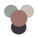

<h1>
   inm （ん？
</h1>


> *我在製作主題的時候，你偷看了罷*  

> [!WARNING]
> 本文件使用銀夢民 / homo 亞文化口癖，屬於圈內玩梗版本。部分句式可能顯得低俗、怪、或在正式場合不合適；
> 看不懂就代表你該去看[README.md](./README.md)。  

迫真低彩度暖色設計系統。  
不是黑白灰糊成一坨，也不是飽和度拉滿的陽角配色（確信

## 這事什麼

`inm` 是一套由四個錨點色做出來的介面調色盤：

> *要 素 察 覺*

-  plum black：深色背景與結構色。
-  clay rose：品牌重點、按鈕、互動狀態。
-  mist gray：冷調支援色，適合狀態、輔助資訊。
-  warm stone：亮色模式畫布。

使用 OKLCH 做感知一致的色彩調整，並參考 APCA 對比目標，讓亮暗模式都能正常閱讀。  
十分甚至九分的可讀（確信


## 配色意圖

亮色模式用 warm stone 當畫布，整體像被日光曬過的石材。  
深色模式用 plum black 當畫布，不是純黑，所以不會看兩眼就想自裁。

Clay rose 負責品牌和動作提示。Mist gray 負責冷靜一下，讓狀態、metadata、輔助視覺不要全部擠在同一個色相裡。  
神所創造的 dashboard，並非完美；但至少顏色可以先救一下（迫真

## 我已經等不及了快點端上來罷

Tailwind CSS v4：

```css
@import "./tailwind-theme.css";
```

然後使用語意 class：

```html
<main class="bg-bg text-text font-sans">
  <section class="bg-surface border border-border rounded-control shadow-panel">
    <button class="bg-accent text-on-accent rounded-control">
      Apply Palette
    </button>
  </section>
</main>
```

Tailwind CSS v3 則使用 [assets/tailwind.config.js](./assets/tailwind.config.js)，並在 app root 定義同名 CSS custom properties。  
~~有什麼再搓一遍 token 的必要嗎（惱~~

## 核心 Token

```css
--color-bg: oklch(81.0% 0.017 64.6);
--color-surface: oklch(86.8% 0.013 63.9);
--color-raised: oklch(91.4% 0.011 63.4);
--color-text: oklch(28.5% 0.020 322.5);
--color-muted: oklch(47.9% 0.010 349.6);
--color-border: oklch(73.6% 0.011 58.2);
--color-accent: oklch(47.9% 0.065 27.6);
--color-accent-soft: oklch(60.0% 0.060 30.0);
--color-cool: oklch(60.0% 0.013 170.0);
--color-on-accent: oklch(91.4% 0.011 63.4);
```

暗色模式覆寫已經收在 [assets/tailwind-theme.css](./assets/tailwind-theme.css)，詳細規格在 [DESIGN.md](./DESIGN.md)。  

## 對比注意

- 正文用 `--color-text`。
- 次要資訊用 `--color-muted`。
- 按鈕、連結、active state 用 `--color-accent`。
- 不要把原始 `#A1736B` 當小字放在 `#C9BFB6` 上，對比不足不可避。
- `#979F9B` 是支援色，不是正文色。亂用就會變成迷霧閱讀（惱

## 使用場合

適合：

- 編輯工具
- 作品集系統
- 儀表板
- 產品介面
- 安靜的創作工具

不適合：

- 霓虹賽博大爆炸
- 純黑純白極端高反差
- 每個按鈕都要尖叫的品牌

這是一套安靜、溫、低彩度、可掃讀的 UI 配色。  
懂的都懂，不懂的也能看清字（讚賞。

## License

看 [LICENSE](./LICENSE)。  
遵守 license，請（無慈悲
